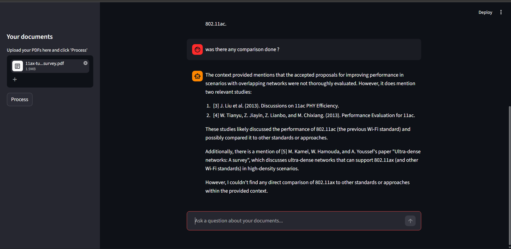

# Atlas 📚



**Atlas** is a production-inspired Retrieval-Augmented Generation (RAG) application. It allows users to upload multiple PDF documents and converse with an AI assistant to extract information, summarize content, and answer complex questions based *only* on the provided context.

Unlike basic RAG prototypes, Atlas implements a decoupled microservice architecture using **FastAPI** for backend routing and **Celery/Redis** for asynchronous, non-blocking document embedding.

---

## 🏗️ Architecture

The system is built to mimic real-world enterprise AI applications:

`Streamlit` ➔ `FastAPI` ➔ `Celery Task Queue` ➔ `LangChain Core Pipeline`

1. **Frontend (Streamlit):** Acts purely as a UI client. It sends documents and questions to the backend and polls for background task completion.
2. **Backend API (FastAPI):** Handles HTTP requests, manages temporary file storage, and serves the LangChain Expression Language (LCEL) inference chain.
3. **Task Queue (Celery + Redis):** Document parsing and embedding (which are highly resource-intensive) are pushed to background workers. This prevents the API from freezing or timing out during large uploads.
4. **Data Pipeline (LangChain v1.x):** 
    - **PDF Parsing:** `PyMuPDF (fitz)` for high-speed, stream-based text extraction.
    - **Vector Store:** `ChromaDB` (persisted to disk at `./chroma_db`).
    - **Embeddings:** `Ollama` (`mxbai-embed-large`).
    - **LLM Logic:** Pure LCEL (`RunnablePassthrough`, `StrOutputParser`).

## 🛠️ Tech Stack

* **UI:** Streamlit
* **API:** FastAPI, Uvicorn
* **Task Broker/Result Backend:** Redis (Dockerized)
* **Background Workers:** Celery
* **Orchestration:** LangChain Core, LangChain Community
* **Local Inference:** Ollama
* **Cloud Inference:** Groq
* **Vector Database:** ChromaDB

---

## 🚀 Getting Started

### 1. Prerequisites
- Python 3.10+
- [Ollama](https://ollama.com/) installed and running locally.
- [Docker Desktop](https://www.docker.com/products/docker-desktop/) (for Redis).

### 2. Installation
Clone the repository and set up your virtual environment:
```powershell
git clone https://github.com/DhruvDewan08/Atlas.git
cd Atlas
python -m venv venv
.\venv\Scripts\Activate.ps1
pip install -r requirements.txt
```

### 3. Pull Local Models (Ollama)
Ensure you have the required embedding model and your LLM of choice downloaded via Ollama:
```powershell
ollama pull mxbai-embed-large
ollama pull llama3.2 # Or whichever model you configure in .env
```

### 4. Environment Variables
Create a `.env` file in the root directory:
```env
# --- LLM Provider: switch between "ollama" (local) and "groq" (live demo) ---
LLM_PROVIDER=ollama

# Ollama config (local)
LLM_MODEL=llama3.2
OLLAMA_BASE_URL=http://localhost:11434

# Groq config (live demo) - get key from https://console.groq.com
GROQ_API_KEY=your_api_key_here
GROQ_MODEL=llama-3.1-8b-instant

# Embeddings & Storage
EMBEDDING_MODEL=mxbai-embed-large
PERSIST_DIRECTORY=./chroma_db

# Redis configuration for Celery
CELERY_BROKER_URL=redis://localhost:6379/0
CELERY_RESULT_BACKEND=redis://localhost:6379/1
```

---

## 🏃‍♂️ Running the Application

Because of the microservice architecture, you need to run **three separate processes**. Open three terminal windows, activate the `venv` in each, and run the following:

### Step 1: Start Redis (Docker)
Ensure Docker Desktop is running, then start the Redis container:
```powershell
docker-compose up -d redis
```

### Step 2: Start the FastAPI Backend
This starts the REST API that Streamlit talks to.
```powershell
.\venv\Scripts\uvicorn src.api:app --reload --port 8000
```
*(You can test the API manually at `http://localhost:8000/docs`)*

### Step 3: Start the Celery Worker
This background worker listens for document upload tasks and processes them.
```powershell
.\venv\Scripts\celery -A src.tasks.celery_app worker --loglevel=info --pool=solo
```

### Step 4: Start the Streamlit Frontend
```powershell
streamlit run app.py
```

---

## 📁 Project Structure

```text
Atlas/
├── src/
│   ├── api.py          # FastAPI endpoints (/upload, /status, /query)
│   ├── pipeline.py     # Pure data transformation functions (extract, chunk, embed)
│   ├── tasks.py        # Celery worker definitions
│   └── llm.py          # Provider-agnostic LLM factory (Ollama vs. Groq)
├── app.py              # Streamlit frontend client
├── main.py             # FastAPI entry point
├── htmlTemplates.py    # UI CSS and HTML components
├── docker-compose.yml  # Redis configuration
└── pyproject.toml      # Project configuration
```

## ✨ Features
* **Asynchronous Processing:** Upload massive PDFs without locking up the user interface.
* **Provider Agnostic:** Seamlessly switch between free local models (Ollama) and lightning-fast cloud models (Groq) just by changing `.env`.
* **Persistent Memory:** Vector databases are saved to disk, meaning you don't have to re-upload PDFs if you restart the server.
* **Modern LangChain:** Built entirely on modern LCEL, completely avoiding deprecated `chains` and `memory` modules.

---

## ⚠️ Known Limitations
- No authentication — intended for local use only.
- Embedding speed depends heavily on local CPU/GPU performance (if using Ollama).
- Production deployments would require rate limiting, proper CORS setup, and a production WSGI/ASGI server (e.g., Gunicorn).
